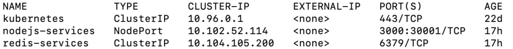

# DevOps project

In this repository you will find all the work that we have done for this project.

## Resume

We have : 

1. Created an app based on the lab4 correction with some new features
2. Applied the CI/CD pipeline with deployment on heroku
3. Applied IaC approach with Vagrant and Ansible
4. Build a docker image of our app
5. Made container orchestration with docker-compose and Kubernetes
6. Deployed our app using Istio
7. Monitored with Prometheus and Grafana

For each task realised, we are going to describe the installation, usage and obtained results.
At the end, we will expose the encountered problems during this project and the bonuses that we have done.

## Tasks description

### 1. Create a web application

For this task, we took the app of lab4 and added some features.

#### Installation

1. Install NodeJS
2. Install Redis
3. Install our application 
  - Located in userapi folder
  - Once in this folder run the following command
```bash
npm install
```

#### Usage 

1. Start the redis server and test if it is working with those commands
```bash
redis-server
redis-cli
ping
```
If the server answers with *PONG*, it is working.

2. Start the web server 
```bash
npm start
```

You should be able to access it on http://localhost:3000

#### Obtained results

Once started, you should see this in your browser  


You can create a user by completing the form and click on *submit*  
If you want to see all the inserted users, click on *All Users*  in the navigation bar.  
This will display them as a list :  
    

So for every user input, the result is added to the existing list as a JSON format that we process to display it in a good way : 
```json
{
  "username": "usernameInput",
  "firstname": "firstnameInput",
  "lastname": "lastnameInput"
}
```

> **Note :** The username is the key in the database. If you input a new user with an existing username, it will update the existing one and not create a new user.  

We also implemented new tests :   

```bash
>npm test

  Configure
    ✓ load default json configuration file
    ✓ load custom configuration

  Redis
    ✓ should connect to Redis

  User
    Create
      ✓ create a new user
      ✓ passing wrong user parameters
      ✓ avoid creating an existing user
    Get
      ✓ get a user by username
      ✓ can not get a user when it does not exist

  User REST API
    POST /user
      ✓ create a new user
      ✓ pass wrong parameters
    GET /user
      ✓ get an existing user
      ✓ can not get a user when it does not exis
```

> **BONUS : All those features are bonuses that we have done to have a better user experience and enrich the given app. They are described at the end of this README.**  

### 2. Apply CI/CD pipeline 

#### Installation  

We configured a CI/CD pipeline using GitHub Actions and Heroku.

This workflow is available [here](.github/workflows/main.yml)

#### Usage 

On every push, GitHub Actions will go through this script automatically.

#### Obtained results  

We can see the results (those are the global results, if we go in detail we can see every step logs):     
     


On Heroku, we can as well see the deployments:  
   


Our app is available on heroku and you can access it via this **[link](https://devops-korkmaz-saadi.herokuapp.com)**    

> **Note :** Only the display of homepage will work because we don't have the subscription to user their database services

### 3. Configure and provision a virtual environment and run your application using the IaC approach


You must have virtualbox and Vagrant installed on your machine to proceed to this step. If your machine already has a virtualbox and Vagrant version, the next
instuctions do not apply to you.

#### Installations

1. Install VirtualBox - https://www.virtualbox.org/wiki/Downloads
2. Install Vagrant on your computer - https://www.vagrantup.com/downloads.html
3. Download the centos/7 Vagrant box for the Virtualbox provider, run:

```bash
vagrant box add centos/7
```
(Choose the third option: virtualbox)

#### Vagrant usage

To start your Vagrant, you must be in the folder [DevOps](DevOps/) and run:
```bash
vagrant up
```
result should be:


Then you can provision your VM if you run:

```bash
vagrant provision
```


This provision run a healcheck on our VM and install nodeJS, npm and redis, what is required to use the application on the VM.
You should be able to have a redis-server running on your vm (we configured it to start the redis server as soon as it is provisionned), and run the test of the
app using:

```bash
vagrant ssh project-server
npm install
npm test
```
The VM succeeding the test should look like:


### 4. Build Docker image of your application & push it to Docker Hub

#### Installation  

No special installation is needed because we created a simple [Dockerfile](Dockerfile) that is able to run our app.

```dockerfile
FROM node:14
WORKDIR /usr/src/app
COPY ./userapi/package*.json ./
RUN npm install
COPY ./userapi/ .
EXPOSE 8080
CMD [ "npm", "start" ]
```

#### Usage 

You can build the image using the Dockerfile  

```bash
docker build -t dockergkz/projectdevops .
```

We tagged it following the <DOCKER_ACCOUNT_NAME>/<CUSTOM_IMAGE_NAME> syntax  

We also pushed it to Docker Hub, you can pull it then run using :

```bash
docker pull dockergkz/projectdevops
docker run -p 12345:8080 dockergkz/projectdevops
```

#### Obtained results

We created a [.dockerignore](.dockerignore) file so when we pull the image, we will need to redo npm install.  
  
We were then able to run the app and access it on http://localhost:12345 by mapping ports. However, you may have connections errors because redis is not on the same container. This is why we need container orchestration.  

### 5. Make container orchestration using Docker Compose

#### Installation

No special installation is needed because we created a simple [docker-compose.yaml](docker-compose.yaml) file that is able to run redis and our app.

#### Usage 

You can run our file 

```bash
docker-compose up
```

We mapped the ports (redis : **5001** on local, **6379** in container - app: **5000** on local, **3000** in container) so that we can access it on (http://localhost:5000) once up

#### Obtained results

When running *docker-compose up* in our terminal, everything starts as it should as you can see on this screenshot : 


Once again, when we access it we see our welcome page. This time it is working! We can add and see users as done in part 1 on our local machine.   

### 6. Make docker orchestration using Kubernetes

#### Installation

First, you will need to start minikube with a kubernetes version. 
Those are the settings that we used but you can change the memory, cpu and k8s vesion with what you have/want :

```bash
minikube start --memory=4096 --cpus=2 --kubernetes-version=v1.22.2
```
Then you have to apply all Manifest YAML files, you should use this command and have the following results :  

```bash
> kubectl apply -f .
deployment.apps/nodejs created
deployment.apps/redis created
persistentvolumeclaim/pv-claim created
persistentvolume/pv-volume created
service/nodejs-services created
service/redis-services created
```

You have to get the services (*kubectl get services*) and you should see something like this :  


Once obtained, you need to make sure that the **clusterIP address of the redis-server service is the same as in the environment variable of redis** in (k8s/deployment.yaml). If not replace it and re-apply *deployment.yaml*

When you get pods, you should obtain : 


You shoulds also have persistent and volume claim, you can check it with :  
```bash
kubectl get pv
kubectl get pvc
```

#### Usage 

Once everything is up and running (following the installation instructions), you can access the web app on http://192.168.99.108:30001

> **Note!!** The address is composed of the minikube ip address, if you don't have the same, you should replace the link by *http://{YOUR-MINIKUBE-IP}:30001

#### Obtained results

You may think that we have something similar to the previous container orchestration but no, it's better!  
Thanks to pv and pvc, even if the pod stops and restart, you'll still have the users that were added earlier.  

For example, we added a user "TEST", stopped the app and restarted it. We still had our user as you can see on this screenshot :  


### 7. Make a service mesh using Istio

#### Installation 

To begin, start you minikube and apply the YAML file to deploy the app and set the app gateaway:   
```bash
kubectl apply -f service.yaml
kubectl apply -f deployment.yaml
kubectl apply -f pv-claim.yaml
kubectl apply -f pv-volume.yaml
kubectl get pods //verification
kubectl get services //verification
kubectl apply -f gateway.yaml
```

Now you can install Istio : 
```bash
curl -L https://istio.io/downloadIstio | sh -
cd istio-1.12.1
export PATH=$PWD/bin:$PATH
istioctl install --set profile=demo -y
kubectl label namespace default istio-injection=enabled
istioctl analyze //verification
export INGRESS_PORT=$(kubectl -n istio-system get service istio-ingressgateway -o jsonpath='{.spec.ports[?(@.name=="http2")].nodePort}')
export SECURE_INGRESS_PORT=$(kubectl -n istio-system get service istio-ingressgateway -o jsonpath='{.spec.ports[?(@.name=="https")].nodePort}')
echo "$INGRESS_PORT"
kubectl rollout status deployment/kiali -n istio-system
```

#### Usage 

To be able to test and use what has been installed, you need to start a minikube tunnel
```bash
minikube tunnel
```
And then you can open the kiali dashboard : 
```bash
istioctl dashboard kiali
```

#### Obtained results

On our dashboard, we can see the traffic and route between 2 different versions of the app. 
We can shift between them, in the following screenshot we directed everything on the latest version :  
  
  
    
### 8. Implement Monitoring to your containerized application
At the end of the previous step, you should have a K8s cluster running, do not delete it, simply follow these instructions to be able to monitore your app.

#### Install Prometheus and Grafana to your K8s cluster

```bash
kubectl apply -f https://raw.githubusercontent.com/istio/istio/release-1.12/samples/addons/prometheus.yaml
kubectl apply -f https://raw.githubusercontent.com/istio/istio/release-1.12/samples/addons/grafana.yaml
```
#### Start monitoring

To start your prometheus dashboard, run:
```bash
istioctl dashboard prometheus
```
it should return an url, where you will find your Prometheus Graph.
Then click to the right of Prometheus in the header.
Execute a Prometheus query.

In the “Expression” input box at the top of the web page, enter the text:
```bash
istio_requests_total
```

Result should look like this (we here count all the request to our app):

  

To start your Grafana monitore, run:
```bash
istioctl dashboard grafana
```
it should return an url, where you will find your Grafana dashboard.

Result should look like this (we here count all the request to our app):

  
  
  


### Problems encountered

Even if we succeedded in the majority of the tasks that were necessary for this project, we encountered some problems that were showstoppers and blocked us.
The main problem that we couldnt avoid is that the computer stopped working or became really slow. For example, with minikube, it quickly lagged and no commands were possible. Sometimes I (Gabrielle) had to do 15 to 20 times the same command before it starts working again which imply that a little modification can take multiple hours to be tested and even sometimes it was impossible to test. 
Fortunately, Yannis' computer was able to support a little more those VMs which made it possible (but with a lot of difficulties) for us to go further in some tasks.

### Bonuses

As a bonus, we implemented new tests and features with a friendly interface to the app.  
Now, you can add users directly from it and access to all the users in the database on the app which was not possible before. 

As you can see on the screenshots above, we have two pages : 

- [The welcome page](/userapi/src/hello.html)
It is an html page (styled with css) with a form. In this form we have the 3 needed fields : username, firstname and lastname.  
To send the form we used jQuery that posts the data to the route "addUser".  
These infomartion are then treated in our [app](/userapi/src/index.js) with the following code : 

```javascript
app.post('/addUser', (req, res) => {
  const {username, firstname, lastname} = req.body
  client.set(username, JSON.stringify({
    username : username,
    firstname : firstname,
    lastname: lastname,
  }))
}) 
```
- [See all users page](userapi/src/views/userslist.ejs)

This page uses ejs (embedded javascript) to work. It is a templating language that makes it possible to send data from our app to a HTML code and use it in the page.  

We show our page with the *res.render* that is done after extracting all the users as JSON : 
```javascript
app.get('/allUsers', (req, res) => {
  client.keys('*',(err, keysUsers)=>{
    if(keysUsers){
      const allUsers = []
      async.map(keysUsers, function(user,callB){
        client.get(user, function(err, result){
          if(err) return console.log(err)
          var userInfo = {}
          userInfo['username'] = user
          userInfo['firstname'] = JSON.parse(result).firstname
          userInfo['lastname'] = JSON.parse(result).lastname
          callB(null, userInfo)
        })
      }, function(error, finalResults){
        if(error) return console.log(error)
        const users= finalResults
        res.render('userslist', {users: users})
      })
    }else{
      res.send('No users')
    }
  })
})
```  

We can then use it in our ejs file like this :  
```html
<% users.forEach((user) => { %>
  <div class=userDiv>
    <h4 ><%= user.username %></h4>
    <h5 >Firstname : <%= user.firstname %></h5>
    <h5 >Lastname : <%= user.lastname %></h5>
  </div>
<% }) %>
```

All the work that we have done to improve the web app allowed us to learn new things (as ejs for example) and we realised how redis and express could interact without always using the CLI.

## Author

KORKMAZ Gabrielle - gabrielle.korkmaz@edu.ece.fr  
SAADI Yannis - yannis.saadi@edu.ece.fr


