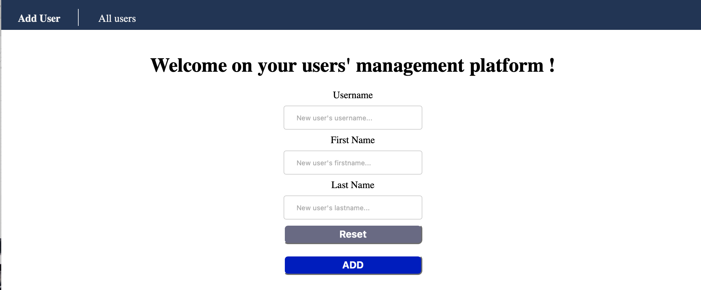

# DevOps project

In this repository you will find all the work that we have done for this project.

## Brief

We have : 

1. Created an app based on the lab4 correction with some new features
2. Applied the CI/CD pipeline with deployment on heroku
3. Applied IaC approach with Vagrant and Ansible
4. Build a docker image of our app
5. Made container orchestration with docker-compose and Kubernetes
6. Deployed our app using Istio
7. Monitored with Prometheus and Grafana

For each task realised, we are going to describe the installation, usage and obtained results.
At the end, we will expose the encountered problems during this project.

## Tasks' description

### 1. Create a web application

For this task, we took the app of lab4 and added some features.

#### Installation

1. Install NodeJS
2. Install Redis
3. Install our application 
  - Located in userapi folder
  - Once in this folder run the following command
```bash
npm install
```

#### Usage 

1. Start the redis server and test if it is workking with those commands
```bash
redis-server
redis-cli
ping
```
If the server answer with *PONG*, it is working.

2. Start the web server 
```bash
npm start
```

You should be able to acces is on (http://localhost:3000)

#### Obtained results

Once started, you should see this in your browser  


You can create a user by completing the form and click on *submit*  
If you want to see al the inserted users, click on *See all users!*  
This will display them as JSON files as you can see bellow with an exemple of what has been done  

So for every user input, the result should be added to the existing list with this format : 
```json
...
{
      "username": "usernameInput",
      "firstname": "firstnameInput",
      "lastname": "lastnameInput"
   }
...
```

> **Note!** The username is the key in the database. If you input a new user with an existing username, it will update the existing one and not create a new user.  

We also implemented new tests :   

```bash
>npm test

  Configure
    ✓ load default json configuration file
    ✓ load custom configuration

  Redis
    ✓ should connect to Redis

  User
    Create
      ✓ create a new user
      ✓ passing wrong user parameters
      ✓ avoid creating an existing user
    Get
      ✓ get a user by username
      ✓ can not get a user when it does not exist

  User REST API
    POST /user
      ✓ create a new user
      ✓ pass wrong parameters
    GET /user
      ✓ get an existing user
      ✓ can not get a user when it does not exis
```

### 2. Apply CI/CD pipeline 

We configured a CI/CD pipeline using GitHub Actions and Heroku.

<div style="background-color: rgb(50, 50, 50);">

```yaml
name: Node.js CI
on:
  push:
    branches: [ main ]
  pull_request:
    branches: [ main ]
#-------------------------------------  INTEGRATION PART ---------------------------------------#
jobs:
  test:
    runs-on: ubuntu-latest
    #indicating working directory 
    defaults:
      run:
        working-directory: userapi    
    services: 
      # Label used to access the service container
      redis:
        # Docker Hub image
        image: redis
        ports:
          # Opens tcp port 6379 on the host and service container
          - 6379:6379  
    strategy:
      matrix:
        node-version: [14.x]
    steps:
      - uses: actions/checkout@v2
      - name: Use Node.js ${{ matrix.node-version }}
        uses: actions/setup-node@v2
        with:
          node-version: ${{ matrix.node-version }}
      - run: npm ci
      - run: npm run build --if-present
      - run: npm test
  #-------------------------------------  DEPLOY PART ---------------------------------------#
  deploy: 
    needs: test # Requires CI part to be succesfully completed
    runs-on: ubuntu-latest
    steps: 
      - uses: actions/checkout@v2
      - name: Deploy to Heroku
        uses: AkhileshNS/heroku-deploy@v3.12.12
        with:
          heroku_api_key: ${{secrets.HEROKU_API_KEY}}  #Gets it automatically
          heroku_app_name: "devops-korkmaz-saadi" 
          heroku_email: "gabrielle.korkmaz@gmail.com"
          appdir: userapi
```
</div>

On every push, GitHub Actions will go through this script, we can see the reults (those are the glabal results, if we go in detail we can see every step logs):  


On Heroku, we can as well see the deployments:  


Our app is available on heroku and you can acces it via this [link](https://devops-korkmaz-saadi.herokuapp.com)  

> **Note!** Only the display of homepage will work because we don't have the subscription to user their datbase services

### 3. Configure and provision a virtual environment and run your application using the IaC approach

1. Configure with Vagrant: 1 VM running on any Linux distribution 
2. Provision the VM with Ansible, which includes installing and running:
  - language runtime
  - database
  - your application (use [sync folders](https://www.vagrantup.com/docs/synced-folders))
  - health check of your application

### 4. Build Docker image of your application

1. Create a Docker image of your application
2. Push the image to Docker Hub

**Note!** You must [ignore](https://docs.docker.com/engine/reference/builder/#dockerignore-file) all the files and folders that do not need to be included in the image.

### 5. Make container orchestration using Docker Compose

1. Create `docker-compose.yml` file that will start your application

### 6. Make docker orchestration using Kubernetes

1. Install Kubernetes cluster using Minikube
2. Create Kubernetes Manifest YAML files:
  - deployments
  - services
  - persistent volume and persistent volume claim

### 7. Make a service mesh using Istio

1. Deploy your application using Istio
2. Create configuration:
  - route requests between 2 different versions of your app
  - traffic shifting between 2 different versions of your app
  
### 8. Implement Monitoring to your containerized application

1. Install Prometheus and Grafana to your K8s cluster

2. Set up monitoring with Prometheus:

  - Prometheus should contact the application (eg. homepage) and pull its status
  - You should be able to see the status of the application on Prometheus

3. Set up monitoring with Grafana:

  - Link it to the Prometheus server and display the monitored applications
  - Create alerts and trigger them by shutting down your applications.

> Note. You can imagine something different and set up monitoring (eg. memory usage, CPU time, ...)

### 9. Document your project 

Write a sort of report in the `README.md` file which includes the following:

1. List all the work performed (briefly, describing features and bonus tasks).

2. Screenshots (pictures of your screen when you are running a web page, K8s resources, VMs, etc... Provide maximum screenshots)

> Tip. Keep screenshots in a separate folder. Ex.: see how pictures are linked in the `index.md` files of the modules.

3. Provide instructions (commands) of how to:
  - Install (or prepare environment)
  - Use (your application, run your Docker container or Docker Compose cluster, on K8s cluster, ...)
  - Test (your application)
  
4. All the necessary links with the platforms and tools integrated:
  - Heroku
  - Docker Hub
  - ...
  
5. Author

6. Other additional info that you want to include...

> **Note!** Use the correct Markdown syntax to keep your `README.md` file looking good.


## How to get bonuses?

Every initiative will be counted, just don't forget to describe it in your `README.md`.

List of bonus tasks proposed:

1. Use different tools and platforms instead of what has been passed in the labs, for example, GitLab CI/CD, Netlify, etc. This will give you a bigger overview of technologies.
2. Use different languages (Java, Ruby, Python, etc.) to develop the application of part 1.
3. If you use the NodeJS application provided in the [courses/devops/modules/04.continuous-testing/assets/userapi](courses/devops/modules/04.continuous-testing/assets/userapi) folder, bring it with additional features:
  - more different API methods
  - more different unit/functional/integration tests
  - using another database (like MongoDB, MySQL, ...)
  - integrate a documenting package to your source code, for example, [Swagger UI](https://www.npmjs.com/package/express-swagger-generator)
4. Any Kubernetes tasks from [this list](https://kubernetes.io/docs/tasks/). 
5. [Securing microservice communication](https://istio.io/latest/docs/tasks/security/) or with Istio 
6. Etc. 

## Testing

From the root directory of the project, run:

```
npm test
```

## Author

KORKMAZ Gabrielle - gabrielle.korkmaz@edu.ece.fr
SAADI Yannis - yannis.saadi@edu.ece.fr


